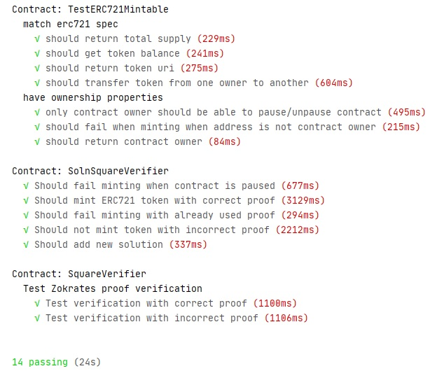

# Udacity Blockchain Capstone

The capstone will build upon the knowledge you have gained in the course in order to build a decentralized housing product. 

## Install dependencies

```
$ npm install
```

## Project directory

```
$ cd eth-contracts
```

## Compile Contracts

```
$ truffle compile
```

## Deploy Contracts on local network

```
$ truffle migrate
```

Local deployment log: [Migrations Local](./artefacts/migrations_local.txt)

## Run tests

Run all tests:
```
$ truffle test
```

Run individual tests:

```
$ truffle test ./test/TestERC721Mintable.js
$ truffle test ./test/TestSolnSquareVerifier.js
$ truffle test ./test/SquareVerifier.js
```

Test output:



## Mint tokens on local network

```
$ NETWORK=local node mint.js
```

Token mint log: [Minting Local](./artefacts/mint_local.txt)

## Deploy Contracts to Rinkeby Test Network

```
$ truffle migrate --network rinkeby
```

Rinkeby deployment log: [Migrations Rinkeby](./artefacts/migrations_rinkeby.txt)

## Contract Addresses

| Contract Name | Contract Address|
|--------------:|:----------------|
|Verifier|https://rinkeby.etherscan.io/address/0x09E05402a347EC21f25Ce7911f5A13e0DA31aeb6|
|SolnSquareVerifier|https://rinkeby.etherscan.io/address/0x8332104f21d14cbb3d06a6acbc56272550ae3eed|

## Contract ABIs

* [Verifier ABI](./artefacts/Verifier.json)
* [SolnSquareVerifier ABI](./artefacts/SolnSquareVerifier.json)

## Mint tokens on Rinkeby Test Network

```
$ NETWORK=rinkeby node mint.js
```

Token mint log: [Minting Rinkeby](./artefacts/mint_rinkeby.txt)

## Minted Token Address

Token: Hamro Ghar (HMGR) 

https://rinkeby.etherscan.io/token/0x8332104f21d14cbb3d06a6acbc56272550ae3eed

## Hamro Ghar: OpenSea Storefront

https://rinkeby.opensea.io/collection/hamro-ghar

Seller address: 0x116375c0D0A8049f436a78870b287f9F962a2248

## HamroGharBuyer: Buyer

https://rinkeby.opensea.io/accounts/HamroGharBuyer

Buyer address: 0x71B5117077aF90644F14DE135CEf6d598F6300E3

# Project Resources

* [Remix - Solidity IDE](https://remix.ethereum.org/)
* [Visual Studio Code](https://code.visualstudio.com/)
* [Truffle Framework](https://truffleframework.com/)
* [Ganache - One Click Blockchain](https://truffleframework.com/ganache)
* [Open Zeppelin ](https://openzeppelin.org/)
* [Interactive zero knowledge 3-colorability demonstration](http://web.mit.edu/~ezyang/Public/graph/svg.html)
* [Docker](https://docs.docker.com/install/)
* [ZoKrates](https://github.com/Zokrates/ZoKrates)
